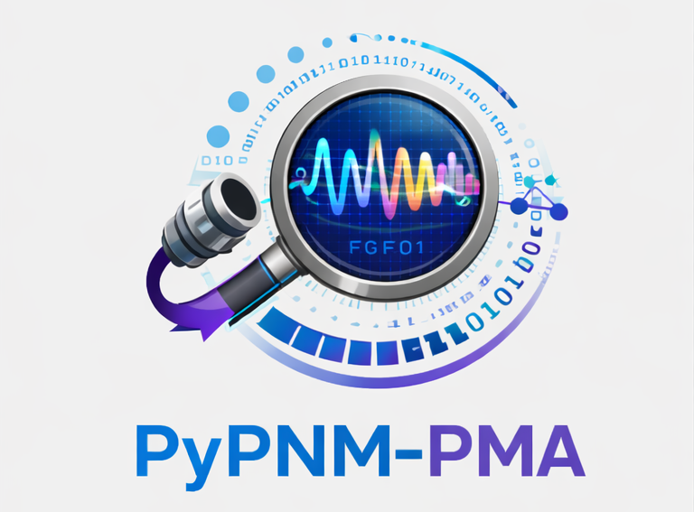

  <a href="docs/index.md">
    <picture>
      <source srcset="docs/images/PyPNM-PMA-dark-mode-hp.png"
              media="(prefers-color-scheme: dark)" />
      
    </picture>
  </a>

# PyPNM-PMA - Profile Management Application Toolkit for PyPNM (Under Development)