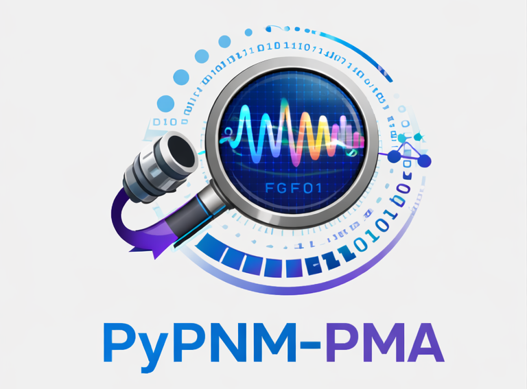

<p align="center">
  <a href="docs/index.md">
    <picture>
      <source srcset="docs/images/PyPNM-PMA-dark-mode-hp.png"
              media="(prefers-color-scheme: dark)" />
      
    </picture>
  </a>
</p>

# PyPNM-PMA - DOCSIS Profile Management Application Toolkit for PyPNM (Under Development)

PyPNM-PMA is a Python toolkit for building DOCSIS Profile Management Applications (PMAs) that design and evaluate OFDM/OFDMA profiles against simulated and real-world RxMER and network impairment conditions. It is intended to support both offline profile engineering (repeatable what-if analysis) and operational evaluation using measured RxMER inputs.

The OFDM/OFDMA simulation capability is one tool within the PyPNM-PMA toolkit. Its purpose is to quantify profile effectiveness under controlled impairments and to provide a consistent test harness for comparing profile strategies before applying them in production workflows.

## Naming

- **PyPI Distribution**: `pypnm-docsis-pma`
- **Python Import Package**: `pypnm_pma`

## Features

- **OFDM/OFDMA Profile Designer**
  - Provide a standardized **profile schema** to build an OFDM or OFDMA profile from a template.
  - Support importing a profile read from a CMTS and mapping it into the same schema for editing and validation.
  - Expose a Python class-based API to construct, normalize, validate, and serialize profile definitions.
  - Run the designed/edited profile through the simulator to score:
    - spectral efficiency (**bits-per-Hz** proxy)
    - robustness vs an RxMER distribution (**RxMER profile**)
    - performance under selectable impairment models

- **Profile Design**: Build candidate OFDM/OFDMA profiles (bit-loading strategies up to 16KQAM) with validation and guardrails.
- **Profile Evaluation**: Score and compare profiles against RxMER distributions and impairment models using consistent KPIs (e.g., BER/FER, margin, robustness).
- **RxMER And Impairment Ingestion**: Normalize and analyze RxMER and related telemetry from simulated sources and real measurements.
- **Simulation Toolkit (One Component)**: OFDM/OFDMA PHY simulation modules used for controlled evaluation of profile behavior under noise and impairment scenarios.
- **Extensible Architecture**: Designed to accommodate CMTS/vendor integration layers and additional impairment models over time.

## How The Designer Fits The Workflow

1. **Create Or Import A Profile**
(1) Start from a standardized schema template, or  
(2) Read an existing profile from the CMTS and map it into the schema.

2. **Edit And Validate**
Apply edits to modulation orders, tone masks, and any guardrails, then validate the schema for correctness and completeness.

3. **Simulate And Score**
Run the profile through the simulation pipeline using:
- a target RxMER distribution (per-tone or aggregate)
- selected impairment models

4. **Report Performance**
Produce decision-ready outputs such as:
- bits-per-Hz proxy and throughput-relative comparisons
- FER/BER versus RxMER curves and threshold crossings
- robustness and margin estimates across modem percentiles (if modeled)

## Getting Started

### Option A: Install From PyPI

1. **Create And Activate A Virtual Environment**:

  ```bash
  python -m venv .venv
  source .venv/bin/activate
  ```

2. **Install**:

  ```bash
  python -m pip install -U pip
  python -m pip install pypnm-docsis-pma
  ```

3. **Verify Import**:

  ```bash
  python -c "import pypnm_pma; print('pypnm_pma import OK')"
  ```

### Option B: Clone The Repository (Developer Install)

1. **Clone The Repository**:

  ```bash
  git clone https://github.com/<org-or-username>/PyPNM-PMA.git
  cd PyPNM-PMA
  ```

2. **Install Dependencies**:

  ```bash
  ./install.sh
  ```

3. **Activate The Virtual Environment**:
  
  ```bash
  source .env/bin/activate
  ```

4. **Editable Install (Recommended For Development)**:

  ```bash
  python -m pip install -e ".[dev]"
  ```

5. **Verify Import**:

  ```bash
  python -c "import pypnm_pma; print('pypnm_pma import OK')"
  ```

## Notes

- This project targets Python `>=3.11`.
- Early development focuses on repeatable simulation and evaluation workflows. CMTS/vendor integration hooks are expected to evolve as the toolkit matures.
