```mermaid
flowchart LR
    A[Configure OFDM Profile<br/>Per-Subcarrier Modulation Up To 16KQAM] --> B[Generate Pseudo-Random Payload<br/>N Bytes]
    B --> C[Frame Into Blocks<br/>Scramble / FEC Input]
    C --> D[FEC Encode<br/>LDPC Inner + BCH Outer]
    D --> E[Interleave<br/>Time Interleaver + Frequency Interleaver]
    E --> F[Bit Loading / QAM Map<br/>Per-Subcarrier Constellations]
    F --> G[OFDM Modulate<br/>IFFT + Cyclic Prefix]
    G --> H[Channel Model<br/>AWGN + Optional Impairments]
    H --> I[OFDM Demodulate<br/>Remove CP + FFT]
    I --> J[Equalization Model<br/>Perfect/Estimated Channel]
    J --> K[Demap To Soft Bits<br/>LLRs Per Subcarrier]
    K --> L[Deinterleave<br/>Frequency + Time]
    L --> M[FEC Decode<br/>LDPC Then BCH]
    M --> N[Compare To Original Payload<br/>BER/FER + Profile KPIs]
```

<!-- SPDX-License-Identifier: Apache-2.0 -->
<!-- Copyright (c) 2026 Maurice Garcia -->

# DOCSIS OFDM Profile Effectiveness Simulator

## Purpose

Simulate an end-to-end DOCSIS downstream OFDM PHY pipeline representing:

- **CMTS (TX)** produces an OFDM waveform based on an assigned **OFDM profile** (bit-loading / modulation order per subcarrier, up to **16KQAM**).
- **Channel/Plant** injects controlled impairments (noise and optionally frequency-selective distortion) producing an effective **RxMER** outcome at the receiver.
- **Cable Modem (RX)** demodulates and decodes, then compares recovered payload vs the original pseudo-random payload to quantify **profile effectiveness** as a function of RxMER (and related impairment parameters).

Primary goal: evaluate how an OFDM profile behaves under targeted RxMER conditions using repeatable, parameterized simulations.

## Scope And Non-Goals

### In Scope
- Pseudo-random payload generation (N-length byte stream)
- Framing into FEC codewords (BCH/LDPC conceptual blocks)
- Time and frequency interleaving (as a configurable module)
- QAM mapping up to 16KQAM and OFDM modulation (IFFT + CP)
- Noise injection (AWGN baseline) and optional impairment hooks
- RX processing (FFT, equalization model, demap to soft bits, deinterleave, decode)
- Metrics: BER/FER, corrected/uncorrectable events, and RxMER-consistent results

### Non-Goals (Initial Version)
- Full normative fidelity to every DOCSIS PHY nuance (exact interleaver permutations, pilot patterns, PLC specifics, etc.)
- Exact vendor-equivalent counter semantics (those can be added once the PHY pipeline is stable)
- Real-time throughput optimization (correctness and repeatability first)

## High-Level Flow (Mermaid)

## Inputs, Outputs, And Key Parameters

### Inputs
- **OFDM profile definition**
  - Subcarrier set (active tones)
  - Modulation order per tone: e.g., {QPSK, 16QAM, 64QAM, 256QAM, 1024QAM, 4096QAM, 16384QAM}
  - Optional: per-tone power scaling, exclusion masks, notches
- **Payload**
  - Pseudo-random bytes of length **N**
  - Seed for repeatability
- **Channel model**
  - AWGN noise level (SNR / EsN0 / EbN0 mapping policy)
  - Optional: frequency-selective fading, tilt, group delay, phase noise, impulse noise hooks
- **OFDM numerology**
  - FFT size, CP length, sampling rate, active carrier map
  - Symbol count to simulate (“few symbol times” supported)
- **FEC configuration**
  - Code rates and block sizes (conceptual first; refine to DOCSIS-consistent parameters over time)

### Outputs
- **Error metrics**
  - BER (bit error rate)
  - FER (frame error rate) / codeword error rate
  - Corrected vs uncorrectable counts (by stage if desired)
- **RxMER-aligned metrics**
  - Estimated RxMER (per tone and/or aggregate)
  - Error performance as a function of RxMER
- **Operational diagnostics (optional)**
  - LLR distributions by modulation order
  - LDPC iterations-to-converge distribution
  - Per-tone “margin” estimates (if modeled)

## Processing Steps Summary

1) **Profile Configuration**
   - Define per-tone modulation order (bit-loading) up to 16KQAM.
   - Define which tones are active and any notch masks.

2) **Payload Generation**
   - Create a reproducible pseudo-random byte stream of length N.
   - Convert bytes to a bitstream.

3) **Framing**
   - Partition the bitstream into FEC input blocks (aligned to your chosen LDPC/BCH block sizes).
   - Apply a scrambler if you want the distribution to match production-like behavior.

4) **FEC Encode**
   - Encode using an inner LDPC and optional outer BCH (typical concatenation model).
   - Produce coded bits suitable for bit-loading/QAM mapping.

5) **Interleaving**
   - Apply a **frequency interleaver** (distributes adjacent coded bits across tones).
   - Apply a **time interleaver** (distributes coded bits across OFDM symbols).
   - Keep this as a module so you can compare “interleaver on/off” or different depths.

6) **Bit Loading And QAM Mapping**
   - Pack coded bits into symbols per tone based on that tone’s modulation order.
   - Map groups of bits to I/Q constellation points (Gray mapping recommended).

7) **OFDM Modulation**
   - Assemble the frequency-domain OFDM symbol with mapped QAM points on active tones.
   - IFFT to produce time-domain samples.
   - Add cyclic prefix (CP).

8) **Channel / Noise Injection**
   - Add AWGN based on the chosen SNR/EsN0/EbN0 policy.
   - Optional hooks for frequency selective effects (per-tone SNR shaping), phase noise, etc.

9) **Receiver OFDM Demodulation**
   - Remove CP.
   - FFT to recover per-tone complex values.

10) **Equalization Model**
   - Apply perfect or estimated equalization (start with perfect for baseline correctness).
   - This block is where you can inject channel-estimation error if desired.

11) **Soft Demapping**
   - Convert received symbols into LLRs (soft bits) using noise variance and constellation geometry.
   - LLR quality will drive LDPC performance and should align with RxMER assumptions.

12) **Deinterleaving**
   - Reverse time and frequency interleaving to restore original coded-bit ordering.

13) **FEC Decode**
   - LDPC decode (iterative) producing corrected bits (and optionally confidence).
   - BCH decode (bounded-distance cleanup) producing final payload bits.

14) **Comparison And Reporting**
   - Compare recovered payload to the original payload.
   - Report BER/FER and stage-specific KPIs.
   - Sweep SNR / RxMER scenarios to generate profile performance curves.

## RxMER Modeling Guidance

RxMER can be treated as an “effective SNR” proxy at the QAM demapper:

- Start with **AWGN-only** and define a mapping between your injected noise variance and an “effective RxMER” measurement.
- Extend to per-tone RxMER by shaping noise variance per subcarrier or applying a frequency-selective response.
- Keep a consistent definition for reporting: per-tone RxMER, average RxMER, and percentile RxMER (e.g., P10).

## Implementation Plan (No Code)

### Phase 0 · Scaffolding And Data Contracts
- Define configuration models:
  - OFDMProfileModel (tone map + modulation per tone)
  - OfdmNumerologyModel (FFT size, CP length, symbol count)
  - ChannelModelConfig (noise policy, optional impairments)
  - FecConfigModel (LDPC/BCH parameters)
  - SimulationRunConfig (seed, N bytes, sweeps)
- Define result models:
  - RunSummaryModel (BER/FER, counts)
  - RxMerSummaryModel (aggregate + per-tone if enabled)
  - Optional diagnostics models

### Phase 1 · QAM + OFDM Baseline (No FEC)
- Implement QAM mapper/demapper up to 16KQAM (Gray mapping).
- Implement OFDM modulator/demodulator:
  - carrier allocation
  - IFFT/FFT
  - CP add/remove
- Add AWGN channel and validate:
  - constellation scatter
  - RxMER estimates
  - BER vs SNR for uncoded modulation

Deliverable: uncoded OFDM link with reliable RxMER reporting.

### Phase 2 · Interleavers
- Implement frequency interleaver and time interleaver modules.
- Validate reversibility and bit-order integrity.
- Add toggles to compare interleaving depth impacts under burst/noise shaping (even before FEC).

Deliverable: reversible interleaving chain integrated into the pipeline.

### Phase 3 · FEC Integration
- Implement BCH encoder/decoder (binary BCH as outer code).
- Implement LDPC:
  - parity-check matrix construction approach for your first version (structured systematic H recommended)
  - min-sum or offset min-sum decoder
  - systematic encoding path
- Integrate concatenated flow:
  - LDPC encode/decode
  - BCH encode/decode
- Validate with no channel noise:
  - perfect decode path returns zero errors

Deliverable: coded OFDM link that round-trips payload at high SNR.

### Phase 4 · Profile Effectiveness Harness
- Add SNR/RxMER sweep runner:
  - multiple seeds
  - multi-run aggregation
- Add profile comparison runner:
  - compare two or more profiles under identical channel conditions
- Add reporting:
  - JSON/CSV summary tables
  - plots (BER/FER vs RxMER)

Deliverable: repeatable evaluation harness to rank profiles by performance under targeted RxMER.

### Phase 5 · DOCSIS-Refinement Hooks (Optional)
- Add per-tone SNR shaping (plant tilt, notches).
- Add channel-estimation error model.
- Add impulse noise or burst noise models for interleaver benefit studies.
- Add “profile rules” consistency checks (tone masks, modulation constraints).

Deliverable: higher-fidelity impairment models relevant to DOCSIS plant conditions.

## Suggested Python Packages

### Core Numeric / DSP
- **numpy**: vectorization, FFT input/output arrays, bit packing utilities
- **scipy**: optional helpers (signal processing utilities, validation, distributions)
- **numba**: accelerate hot loops (LDPC decoding iterations, LLR computations)

### Plotting / Analysis
- **matplotlib**: BER/FER curves, constellation plots
- **pandas** (optional): aggregated results tables, CSV export

### CLI / UX (Optional)
- **typer** (optional): CLI entrypoints for sweeps and profile comparisons
- **rich** (optional): progress bars and human-readable summary output

### FEC Support (Optional Alternatives)
If you choose not to implement BCH/LDPC entirely yourself, you can optionally leverage:
- **galois** (BCH/finite-field tooling) as a reference implementation
- **pyldpc** or other LDPC utilities as reference/validation tools

Recommendation: even if you implement from scratch, keep one reference dependency available in a developer-only extras group for cross-checking correctness.

## Validation Strategy

- **Unit validation**
  - QAM mapper/demapper: round-trip correctness at high SNR
  - OFDM mod/demod: tone mapping integrity, CP handling
  - Interleavers: reversible permutations
  - BCH/LDPC: encode/decode integrity (noise-free)
- **System validation**
  - BER/FER curves monotonic with SNR
  - Profile ordering makes sense (higher-order QAM should require higher RxMER for equivalent FER)
- **Regression stability**
  - Fixed seeds yield stable baseline results
  - Continuous integration runs “small sweeps” quickly to detect drift

## Notes On 16KQAM Practicalities

- 16KQAM requires high effective RxMER; your simulator should:
  - use consistent LLR scaling for large constellations
  - avoid numerical instability (prefer float64 in demapper/LLR if needed)
  - support per-tone noise variance so the profile’s bit-loading sensitivity is visible

<!-- SPDX-License-Identifier: Apache-2.0 -->
<!-- Copyright (c) 2026 Maurice Garcia -->

# DOCSIS OFDM Profile Effectiveness Simulator

## Purpose

Simulate an end-to-end DOCSIS downstream OFDM PHY pipeline representing:

- **CMTS (TX)** produces an OFDM waveform based on an assigned **OFDM profile** (bit-loading / modulation order per subcarrier, up to **16KQAM**).
- **Channel/Plant** injects controlled impairments (noise and optionally frequency-selective distortion) producing an effective **RxMER** outcome at the receiver.
- **Cable Modem (RX)** demodulates and decodes, then compares recovered payload vs the original pseudo-random payload to quantify **profile effectiveness** as a function of RxMER (and related impairment parameters).

Primary goal: evaluate how an OFDM profile behaves under targeted RxMER conditions using repeatable, parameterized simulations.

## Scope And Non-Goals

### In Scope
- Pseudo-random payload generation (N-length byte stream)
- Framing into FEC codewords (BCH/LDPC conceptual blocks)
- Time and frequency interleaving (as a configurable module)
- QAM mapping up to 16KQAM and OFDM modulation (IFFT + CP)
- Noise injection (AWGN baseline) and optional impairment hooks
- RX processing (FFT, equalization model, demap to soft bits, deinterleave, decode)
- Metrics: BER/FER, corrected/uncorrectable events, and RxMER-consistent results

### Non-Goals (Initial Version)
- Full normative fidelity to every DOCSIS PHY nuance (exact interleaver permutations, pilot patterns, PLC specifics, etc.)
- Exact vendor-equivalent counter semantics (those can be added once the PHY pipeline is stable)
- Real-time throughput optimization (correctness and repeatability first)

## High-Level Flow (Mermaid)

## Inputs, Outputs, And Key Parameters

### Inputs
- **OFDM profile definition**
  - Subcarrier set (active tones)
  - Modulation order per tone: e.g., {QPSK, 16QAM, 64QAM, 256QAM, 1024QAM, 4096QAM, 16384QAM}
  - Optional: per-tone power scaling, exclusion masks, notches
- **Payload**
  - Pseudo-random bytes of length **N**
  - Seed for repeatability
- **Channel model**
  - AWGN noise level (SNR / EsN0 / EbN0 mapping policy)
  - Optional: frequency-selective fading, tilt, group delay, phase noise, impulse noise hooks
- **OFDM numerology**
  - FFT size, CP length, sampling rate, active carrier map
  - Symbol count to simulate (“few symbol times” supported)
- **FEC configuration**
  - Code rates and block sizes (conceptual first; refine to DOCSIS-consistent parameters over time)

### Outputs
- **Error metrics**
  - BER (bit error rate)
  - FER (frame error rate) / codeword error rate
  - Corrected vs uncorrectable counts (by stage if desired)
- **RxMER-aligned metrics**
  - Estimated RxMER (per tone and/or aggregate)
  - Error performance as a function of RxMER
- **Operational diagnostics (optional)**
  - LLR distributions by modulation order
  - LDPC iterations-to-converge distribution
  - Per-tone “margin” estimates (if modeled)

## Processing Steps Summary

1) **Profile Configuration**
   - Define per-tone modulation order (bit-loading) up to 16KQAM.
   - Define which tones are active and any notch masks.

2) **Payload Generation**
   - Create a reproducible pseudo-random byte stream of length N.
   - Convert bytes to a bitstream.

3) **Framing**
   - Partition the bitstream into FEC input blocks (aligned to your chosen LDPC/BCH block sizes).
   - Apply a scrambler if you want the distribution to match production-like behavior.

4) **FEC Encode**
   - Encode using an inner LDPC and optional outer BCH (typical concatenation model).
   - Produce coded bits suitable for bit-loading/QAM mapping.

5) **Interleaving**
   - Apply a **frequency interleaver** (distributes adjacent coded bits across tones).
   - Apply a **time interleaver** (distributes coded bits across OFDM symbols).
   - Keep this as a module so you can compare “interleaver on/off” or different depths.

6) **Bit Loading And QAM Mapping**
   - Pack coded bits into symbols per tone based on that tone’s modulation order.
   - Map groups of bits to I/Q constellation points (Gray mapping recommended).

7) **OFDM Modulation**
   - Assemble the frequency-domain OFDM symbol with mapped QAM points on active tones.
   - IFFT to produce time-domain samples.
   - Add cyclic prefix (CP).

8) **Channel / Noise Injection**
   - Add AWGN based on the chosen SNR/EsN0/EbN0 policy.
   - Optional hooks for frequency selective effects (per-tone SNR shaping), phase noise, etc.

9) **Receiver OFDM Demodulation**
   - Remove CP.
   - FFT to recover per-tone complex values.

10) **Equalization Model**
   - Apply perfect or estimated equalization (start with perfect for baseline correctness).
   - This block is where you can inject channel-estimation error if desired.

11) **Soft Demapping**
   - Convert received symbols into LLRs (soft bits) using noise variance and constellation geometry.
   - LLR quality will drive LDPC performance and should align with RxMER assumptions.

12) **Deinterleaving**
   - Reverse time and frequency interleaving to restore original coded-bit ordering.

13) **FEC Decode**
   - LDPC decode (iterative) producing corrected bits (and optionally confidence).
   - BCH decode (bounded-distance cleanup) producing final payload bits.

14) **Comparison And Reporting**
   - Compare recovered payload to the original payload.
   - Report BER/FER and stage-specific KPIs.
   - Sweep SNR / RxMER scenarios to generate profile performance curves.

## RxMER Modeling Guidance

RxMER can be treated as an “effective SNR” proxy at the QAM demapper:

- Start with **AWGN-only** and define a mapping between your injected noise variance and an “effective RxMER” measurement.
- Extend to per-tone RxMER by shaping noise variance per subcarrier or applying a frequency-selective response.
- Keep a consistent definition for reporting: per-tone RxMER, average RxMER, and percentile RxMER (e.g., P10).

## Implementation Plan (No Code)

### Phase 0 · Scaffolding And Data Contracts
- Define configuration models:
  - OFDMProfileModel (tone map + modulation per tone)
  - OfdmNumerologyModel (FFT size, CP length, symbol count)
  - ChannelModelConfig (noise policy, optional impairments)
  - FecConfigModel (LDPC/BCH parameters)
  - SimulationRunConfig (seed, N bytes, sweeps)
- Define result models:
  - RunSummaryModel (BER/FER, counts)
  - RxMerSummaryModel (aggregate + per-tone if enabled)
  - Optional diagnostics models

### Phase 1 · QAM + OFDM Baseline (No FEC)
- Implement QAM mapper/demapper up to 16KQAM (Gray mapping).
- Implement OFDM modulator/demodulator:
  - carrier allocation
  - IFFT/FFT
  - CP add/remove
- Add AWGN channel and validate:
  - constellation scatter
  - RxMER estimates
  - BER vs SNR for uncoded modulation

Deliverable: uncoded OFDM link with reliable RxMER reporting.

### Phase 2 · Interleavers
- Implement frequency interleaver and time interleaver modules.
- Validate reversibility and bit-order integrity.
- Add toggles to compare interleaving depth impacts under burst/noise shaping (even before FEC).

Deliverable: reversible interleaving chain integrated into the pipeline.

### Phase 3 · FEC Integration
- Implement BCH encoder/decoder (binary BCH as outer code).
- Implement LDPC:
  - parity-check matrix construction approach for your first version (structured systematic H recommended)
  - min-sum or offset min-sum decoder
  - systematic encoding path
- Integrate concatenated flow:
  - LDPC encode/decode
  - BCH encode/decode
- Validate with no channel noise:
  - perfect decode path returns zero errors

Deliverable: coded OFDM link that round-trips payload at high SNR.

### Phase 4 · Profile Effectiveness Harness
- Add SNR/RxMER sweep runner:
  - multiple seeds
  - multi-run aggregation
- Add profile comparison runner:
  - compare two or more profiles under identical channel conditions
- Add reporting:
  - JSON/CSV summary tables
  - plots (BER/FER vs RxMER)

Deliverable: repeatable evaluation harness to rank profiles by performance under targeted RxMER.

### Phase 5 · DOCSIS-Refinement Hooks (Optional)
- Add per-tone SNR shaping (plant tilt, notches).
- Add channel-estimation error model.
- Add impulse noise or burst noise models for interleaver benefit studies.
- Add “profile rules” consistency checks (tone masks, modulation constraints).

Deliverable: higher-fidelity impairment models relevant to DOCSIS plant conditions.

## Suggested Python Packages

### Core Numeric / DSP
- **numpy**: vectorization, FFT input/output arrays, bit packing utilities
- **scipy**: optional helpers (signal processing utilities, validation, distributions)
- **numba**: accelerate hot loops (LDPC decoding iterations, LLR computations)

### Plotting / Analysis
- **matplotlib**: BER/FER curves, constellation plots
- **pandas** (optional): aggregated results tables, CSV export

### CLI / UX (Optional)
- **typer** (optional): CLI entrypoints for sweeps and profile comparisons
- **rich** (optional): progress bars and human-readable summary output

### FEC Support (Optional Alternatives)
If you choose not to implement BCH/LDPC entirely yourself, you can optionally leverage:
- **galois** (BCH/finite-field tooling) as a reference implementation
- **pyldpc** or other LDPC utilities as reference/validation tools

Recommendation: even if you implement from scratch, keep one reference dependency available in a developer-only extras group for cross-checking correctness.

## Validation Strategy

- **Unit validation**
  - QAM mapper/demapper: round-trip correctness at high SNR
  - OFDM mod/demod: tone mapping integrity, CP handling
  - Interleavers: reversible permutations
  - BCH/LDPC: encode/decode integrity (noise-free)
- **System validation**
  - BER/FER curves monotonic with SNR
  - Profile ordering makes sense (higher-order QAM should require higher RxMER for equivalent FER)
- **Regression stability**
  - Fixed seeds yield stable baseline results
  - Continuous integration runs “small sweeps” quickly to detect drift

## Notes On 16KQAM Practicalities

- 16KQAM requires high effective RxMER; your simulator should:
  - use consistent LLR scaling for large constellations
  - avoid numerical instability (prefer float64 in demapper/LLR if needed)
  - support per-tone noise variance so the profile’s bit-loading sensitivity is visible

## Phase Development Plan

This plan uses the flowchart above as the architectural backbone. Each phase produces a working vertical slice with stable interfaces that carry forward into the next phase.

**100% Python** is interpreted here as:
- No external command-line tools or binaries invoked from Python
- All processing occurs inside the Python runtime and its installed packages
- NumPy/SciPy/Numba are acceptable (installed as Python packages)

If you require “pure Python only” (no compiled wheels at all), the package list and performance expectations change materially.

### Phase 0 · Repository Skeleton And Data Contracts

**Goal**  
Define module boundaries and stable configuration/result contracts so every subsequent phase plugs into the same pipeline.

**Deliverables**
- Package layout aligned to the flowchart blocks
- Typed config models and result models (profile, numerology, channel, FEC, run)
- Deterministic RNG policy (seed handling and reproducible runs)
- Runner wiring with stubbed modules and “identity” pass-through defaults

**Packages**
- `pydantic` (preferred) or stdlib `dataclasses` (if you want fewer dependencies)
- `numpy` (canonical numeric/array types, even before DSP starts)
- `pytest`

**Links To Next Phase**
- Locks the simulator contracts: `ProfileModel`, `OfdmNumerologyModel`, `ChannelModelConfig`, `FecConfigModel`, `SimulationRunConfig`, and `RunSummaryModel`.

### Phase 1 · Bitstream, Framing, And Profile Representation

**Goal**  
Build the data plane from payload bytes to structured bit blocks ready for mapping and later FEC, without OFDM modulation.

**Deliverables**
- Pseudo-random payload generator (N-length bytes, deterministic via seed)
- Byte↔bit conversion and block segmentation utilities
- Profile loader/validator (tone masks, per-tone modulation order up to 16KQAM)

**Packages**
- `numpy`
- `pydantic`
- `pytest`

**Links To Next Phase**
- Outputs canonical `FrameBlocks` and a validated `ProfileModel` used by the mapper/demapper.

### Phase 2 · QAM Mapping And Demapping Up To 16KQAM (Uncoded)

**Goal**  
Implement per-tone constellation mapping and soft/hard demapping independent of OFDM. Validate correctness and LLR behavior before introducing IFFT/FFT.

**Deliverables**
- Gray-mapped constellations for M-QAM up to 16384-QAM
- Mapper: bits → complex symbols (per-tone modulation order)
- Demapper:
  - hard decision (nearest-point)
  - soft decision LLRs (noise variance aware)
- Unit tests for round-trip at high SNR and LLR sanity checks

**Packages**
- `numpy`
- `numba` (optional, but recommended for high-order QAM LLR loops)
- `pytest`

**Links To Next Phase**
- Produces `QamMapper` and `QamDemapper` components that plug directly into OFDM modulation.

### Phase 3 · OFDM Modulation/Demodulation (IFFT/FFT + CP)

**Goal**  
Convert mapped tones into time-domain OFDM symbols and recover them back into tones, initially under a perfect/noiseless channel.

**Deliverables**
- Carrier allocation policy (active tone placement into FFT bins, DC/guard handling)
- OFDM modulator (IFFT + cyclic prefix insertion)
- OFDM demodulator (CP removal + FFT)
- Integrity tests (no channel): recovered tones match transmitted tones within tolerance

**Packages**
- `numpy` (FFT/IFFT via `np.fft`)
- `pytest`

**Links To Next Phase**
- Establishes the core transport: `ToneGrid → TimeWaveform → ToneGrid`, enabling channel/noise injection.

### Phase 4 · Channel Model And RxMER Estimation (AWGN Baseline)

**Goal**  
Add controlled noise and produce RxMER-consistent reporting. This creates the baseline axis against which profiles are compared.

**Deliverables**
- AWGN injection (time-domain baseline) and/or optional per-tone noise shaping (frequency-domain)
- Noise variance policy: define how SNR/EsN0/EbN0 maps to injected noise variance
- RxMER estimator (aggregate and optionally per-tone)
- Uncoded BER vs RxMER sanity curves across modulation orders

**Packages**
- `numpy`
- `scipy` (optional for distributions/helpers; not required for AWGN)
- `matplotlib` (recommended for curves and constellation validation)
- `pytest`

**Links To Next Phase**
- Stabilizes the measurement loop: profile → channel impairment → RxMER estimate → error metrics trend.

### Phase 5 · Interleavers (Frequency + Time) As Pluggable Modules

**Goal**  
Implement reversible time and frequency interleaving so you can evaluate burst/noise shaping resilience and ensure the pipeline remains invertible.

**Deliverables**
- Frequency interleaver module + inverse
- Time interleaver module + inverse
- Interleaver depth configuration and “identity” mode
- Strict reversibility and bit-order integrity tests

**Packages**
- `numpy`
- `pytest`

**Links To Next Phase**
- Interleavers sit between FEC and mapping: `coded_bits → interleave → map` and `demap → deinterleave → decode`.

### Phase 6 · FEC Integration (LDPC/BCH) With Clear Stage Metrics

**Goal**  
Integrate BCH/LDPC and connect decoder performance to RxMER and profile choices. Correctness and repeatability are prioritized over exact DOCSIS PHY fidelity in the first iteration.

**Deliverables**
- FEC framing and rate-matching rules (pack payload into BCH blocks, then into LDPC blocks)
- BCH encoder/decoder (outer)
- LDPC encoder/decoder (inner):
  - structured systematic encoding path
  - min-sum / offset min-sum iterative decoding
- Stage metrics:
  - LDPC iterations-to-converge distribution
  - corrected vs uncorrectable counts (per stage)
- No-noise validation: round-trip produces zero errors at very high SNR

**Packages**
- `numpy`
- `numba` (recommended for iterative LDPC decode hot loops)
- `scipy.sparse` (optional if you represent H as sparse; adjacency-list decoding often performs better)
- `pytest`

**Links To Next Phase**
- Produces the first fully closed-loop system: payload → coded OFDM → noise → decode → payload compare, enabling profile ranking.

### Phase 7 · Profile Effectiveness Harness (Sweeps, Comparisons, Reporting)

**Goal**  
Turn the pipeline into a repeatable evaluation tool to compare profiles under identical channel conditions and produce decision-ready output.

**Deliverables**
- Sweep runner:
  - RxMER/SNR grid sweeps
  - multiple seeds per point
  - aggregated statistics (mean, percentiles, optional confidence intervals)
- Profile comparison runner:
  - evaluate multiple profiles under identical seeds/channel settings
  - rank profiles by threshold crossings (e.g., FER < 1e-3 at RxMER = X)
- Report outputs:
  - JSON/CSV summaries
  - plots (BER/FER vs RxMER, per-modulation grouping)

**Packages**
- `numpy`
- `pandas` (optional, recommended for aggregation and CSV)
- `matplotlib`
- `typer` (optional CLI entrypoints for sweeps)
- `rich` (optional progress and formatted summaries)
- `pytest`

**Links To Next Phase**
- Creates stable artifacts and schemas so impairment models and fidelity improvements can be added without changing analysis tooling.

### Phase 8 · DOCSIS Refinement Hooks (Optional, Incremental Fidelity)

**Goal**  
Add DOCSIS-relevant impairment models and PHY refinements without destabilizing the existing pipeline and reporting.

**Deliverables**
- Per-tone SNR shaping (tilt, notches)
- Frequency selective channel response (group delay / ripple) and equalizer model variants
- Channel-estimation error injection and phase noise hooks
- Burst/impulse noise models (to quantify interleaver benefit)
- Profile rule enforcement and guardrails (sanity checks on bit-loading constraints)

**Packages**
- `numpy`
- `scipy.signal` (optional for channel impulse responses / filtering utilities)
- `numba` (optional if impairment loops become hot)
- `pytest`

**Links To Prior Work**
- Refinements are confined to `channel/` and `equalization/` modules while preserving the stable contracts and reporting introduced in earlier phases.

